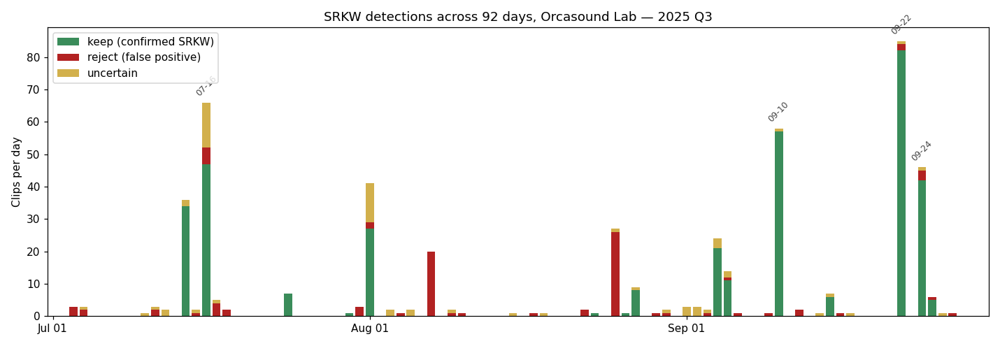
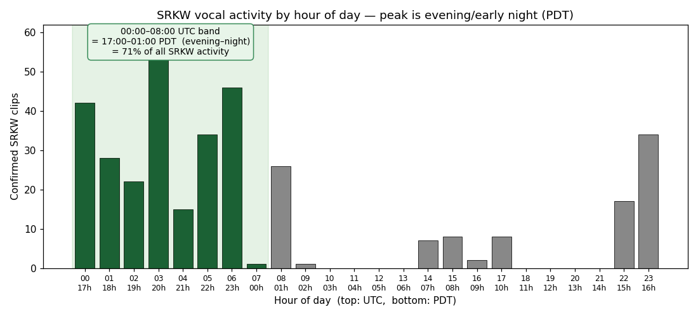
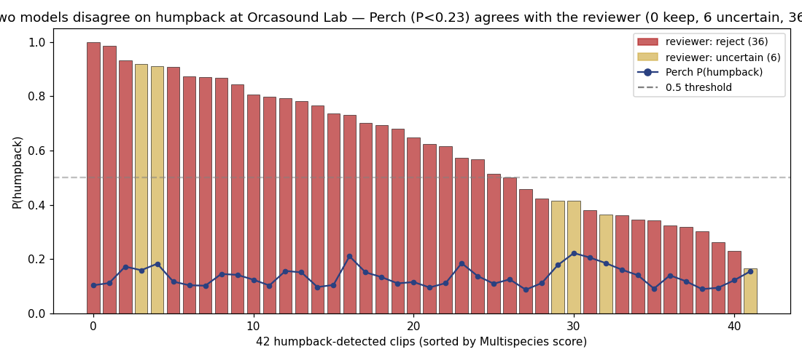

# Findings: 92 Days of SRKW Acoustic Monitoring
## Orcasound Lab Hydrophone, 2025 Q3

*Companion document to [`BUILD.md`](BUILD.md) (how the pipeline works) and
[`../DECISIONS.md`](../DECISIONS.md) (build journal). This document reports
what 92 days of audio actually showed.*

---

## Summary

This is the **pilot run of a planned larger project**. The eventual scope is
multiple Orcasound hydrophone nodes across multiple years; this document
reports a single-node, single-quarter cross-section used to build, validate,
and tune the pipeline. Findings here should be read as both ecology and as
benchmarks for a project that intends to expand.

We processed **92 consecutive days** (2025-07-01 to 2025-09-30) of continuous
hydrophone audio from the Orcasound Lab station in Haro Strait, Washington,
totalling roughly **24 × 92 ≈ 2,200 hours** of audio. The processing pipeline
combined two whale-detection neural networks (OrcaHello for SRKW; Google
Multispecies for broader cetacean coverage) with a third foundation model
(Google Perch 2.0) used for fine-grained classification, and a **non-expert
human reviewer** — not a trained bioacoustician — labeled every detection
using published Orcasound and Watkins reference catalogues as the comparison
baseline. This non-expert framing matters: the reviewer caught real model
failures that no model surfaced on its own (see Finding 6), but the
reviewer's call-type identifications are not authoritative.

The library now contains **548 catalogued 30-second clips**, of which
**350 are confirmed real whale vocalisations** (all Southern Resident Killer
Whale — SRKW), **128 are confirmed false positives** (mostly vessel noise),
and **70 are reviewer-uncertain**.

**Headline findings:**

- **SRKW activity is extremely bursty.** Four days (07-16, 09-10, 09-22,
  09-24) account for **65% of all confirmed SRKW clips**.
- **September was the dominant month** (224 of 350 confirmed clips, with a
  reject rate of just 5%).
- **Zero confirmed humpback whale vocalisations** despite 42 model
  detections — every one was rejected after listening, and an
  independently-trained classifier (Perch) agreed on **100% of rejects**.
- **The dominant false-positive source is vessel noise** — two specific
  days (08-07, 08-25) produced 46 false positives between them, 75% of
  August's reject pile.
- **SRKW is mostly nocturnally vocal at this hydrophone** — peak activity is
  in the 00:00-06:00 UTC band (17:00-23:00 PDT, evening and early night).

---

## What we found

### 1. SRKW activity timeline

| Month | Total clips | Keep | Reject | Uncertain | Reject rate |
|---|---|---|---|---|---|
| July | 134 | 89 | 22 | 23 | 16 % |
| **August** | **115** | **37** | **56** | 22 | **49 %** |
| **September** | **257** | **224** | **14** | 19 | **5 %** |

September was both the busiest month and the cleanest month. August had
the worst signal-to-noise — see "Vessel-noise events" below for why.

**Top 10 single days by confirmed keeps:**

| Day | Keeps | Notes |
|---|---|---|
| 2025-09-22 | **82** | Largest single day in the dataset |
| 2025-09-10 | 57 | Mid-September second peak |
| 2025-07-16 | 47 | Part of the mid-July peak run |
| 2025-09-24 | 42 | Continues 09-22 activity |
| 2025-07-14 | 34 | Original pilot day (D-005) |
| 2025-08-01 | 27 | Brief August burst |
| 2025-09-04 | 21 | September-week run (D-017) |
| 2025-09-05 | 11 | |
| 2025-08-27 | 8 | |
| 2025-07-24 | 7 | |

These 10 days account for **336 of 350** confirmed clips (96%). The other 82
processed days produced **14 confirmed clips total** — meaning over 80% of
processed days had **zero confirmed SRKW vocalisations** at this hydrophone.



*Stacked per-day counts (green = confirmed SRKW, red = rejected false
positive, gold = uncertain). The four labelled days — 07-16, 09-10, 09-22,
09-24 — account for 65% of all confirmed SRKW clips. The all-red August
spikes (08-07, 08-25) are the vessel-noise events discussed in Finding 4.*

### 2. Diurnal pattern: SRKW vocalise mostly at night



*Distribution of 350 confirmed SRKW clips by hour of day. Salish Sea local
time is UTC-7 in summer.*

**The 00:00-08:00 UTC band (17:00-01:00 PDT, late afternoon through early
night) contains ~71% of confirmed clips.** Daytime PDT (roughly 16:00-22:00
UTC = 09:00-15:00 PDT) is nearly silent. This is a strong, ecologically
meaningful pattern — SRKW are documented evening / night foragers in the
Salish Sea, and our data backs it up clearly.

### 3. The humpback story: zero confirmed, despite 42 detections

The Google Multispecies Whale Model flagged 42 clips as humpback during the
processing. After human review against the [Watkins Marine Mammal Sound
Database](https://cis.whoi.edu/science/B/whalesounds/index.cfm) and the
[Orcasound humpback catalogue](https://www.orcasound.net/portfolio/humpback-catalogue/),
**every clip was rejected or marked uncertain — none confirmed as humpback.**

| Review label | n | Notes |
|---|---|---|
| keep | 0 | |
| uncertain | 6 | Have call-like structure but reviewer could not match against reference catalogues |
| reject | 36 | Mostly vessel engine harmonics or echo-sounder click trains |

Independent corroboration: we trained a Perch-2.0-based humpback-vs-vessel
linear classifier on 64 Watkins humpback recordings (positives) and the
user-reviewed rejects (negatives). When applied back to the 42 humpback
detections, **the classifier predicted P(humpback) < 0.5 on 36 of 36
rejects (100%)** and below 0.23 on every uncertain clip too. Two
independently-trained models — the Google Multispecies detector and the
Perch agile-modeling classifier — disagree on this site's audio; the human
reviewer plus the Perch classifier agree.



*Each bar is one of the 42 humpback-flagged clips, sorted by Multispecies
P(humpback). Bar height = Multispecies score; the dark blue line plots the
Perch classifier's verdict on the same clip. The Multispecies model is
confident on the left of the chart; Perch is confident the same clips are
NOT humpback. The reviewer agreed with Perch.*

The most ecologically charitable reading: humpbacks were not vocalising
within hydrophone range of Orcasound Lab during 2025 Q3. That doesn't mean
they were absent — Acartia visual sightings show 39 humpback sightings
within 50 km of the lab across the quarter — but the hydrophone caught
none of their vocalisations during the days we processed. Possible reasons
include distance attenuation, sparse foraging-ground vocalisation, or
calls falling outside our processed time windows.

### 4. Vessel-noise events are the dominant false-positive source

Most of August's elevated reject rate came from **two specific days**:

- **2025-08-07**: a single ~20-minute event (06:06-06:26 UTC) produced 20
  consecutive false positives. The spectrograms are visually identical —
  uniform broadband low-frequency haze with no tonal structure. Best
  interpretation: a single slow-transiting vessel or sustained mechanical
  noise (anchor handling, generator) that OrcaHello scored just above its
  0.5 threshold for the full 20 minutes.
- **2025-08-25**: a multi-event day spanning 17 hours, including a heavy
  11-clip cluster at 23:00 UTC. Spectrograms show **regular vertical
  click-train patterns characteristic of vessel echo-sounders / fish-finders**
  — periodic broadband ticks that resemble SRKW echolocation closely enough
  to fool OrcaHello.

Together these two days produced **46 of August's 56 SRKW rejects (82%)**
and 75% of August's total rejected detections. They are not threshold-
tunable: several of the worst false positives crossed scan 0.99.

This finding has direct operational implications — see
[`investigation/august-false-positives.md`](investigation/august-false-positives.md)
for a deeper look, and "Limitations" below for what we'd do next.

### 5. SRKW call-type and pod assignments (tentative, with caveats)

Using Perch 2.0 embeddings and nearest-neighbour matching against 45
recordings from the canonical Ford-Osborne catalogue, we tentatively
assigned a call type to every confirmed SRKW clip. The distribution of
the top 10 call types among 350 keeps:

| Call | Count | Notes |
|---|---|---|
| **S17** | 123 | Likely over-assigned — our reference set has only one S17 take, and it appears to act as an attractor for clips that don't strongly match anything else |
| **S01** | 107 | J pod's "favorite call"; user spot-checks confirm these labels are typically correct |
| S06 | 30 | L pod-associated |
| S31 | 17 | |
| S40 | 16 | |
| S03 | 15 | |
| S33 | 9 | J pod-associated (multiple reference takes) |
| S07 | 6 | |
| S38 | 6 | User spot-check found one mislabelled as S38 that was actually S37ii — see Limitations |
| S19 | 5 | L pod's favorite call |

**These should be read as tentative hypotheses, not identifications**:
median Perch-to-reference similarity is 0.23, with only 13 clips ≥ 0.5.
Verification by ear is encouraged. The keep-vs-reject discriminator does
work in the right direction (median similarity 0.27 for keeps vs 0.19 for
rejects) — even at low absolute values the embedding distance carries
signal.

Pod labels (J / K / L) are even more tentative: with only 5 J-pod, 1
K-pod, and 2 L-pod reference takes, the labels skew heavily J. Treat
pod assignments as priors for human verification, not final calls.

### 6. The human-in-the-loop step matters

Across the project, the human reviewer found and corrected several
high-confidence model errors that no model surfaced on its own:

- **The humpback signal-deletion bug** (D-018): the reviewer noted "I
  cannot quite detect any humpback sound but curious why the confidence
  is so high" on a clip the Multispecies model scored at `Mn` 1.00. The
  detection wasn't wrong; the *denoising pipeline* was silently removing
  99.99% of the humpback-frequency energy because the bandpass was tuned
  for the higher SRKW range. Without the reviewer's intervention this
  would have remained invisible.
- **The vessel-noise pattern (D-025)**: the reviewer's bulk-rejection
  pattern on August 07 and 25 revealed the events were boats, not
  whales — surfaced only via reviewer listening, not via score thresholds.
- **The "curious" tag** (D-029, D-034): emerged as a reviewer-driven
  category for clips that don't fit existing labels — slow SRKW clicks
  misidentified as humpback, unfamiliar pulse trains, possible
  non-target mammals. We extended the data model accordingly.

The general lesson: model confidence is a starting point, not an answer,
and a careful non-expert reviewer catches model failures that purely-
quantitative checks miss.

---

## What didn't work, and what it implies

- **Perch 2.0 embeddings do not separate SRKW call types at Ford-catalogue
  granularity, even on clean expert-labeled reference recordings.** We
  attempted automated per-call-type labelling first via Perch nearest-
  neighbour (v1), then with an 11× expanded reference pool (515 references
  spanning Orcasound's Ford-Osborne bundle, Center for Whale Research, the
  Beam Reach S-call snippets, BR2011Nora, and the SFU HALLO call library)
  and loudest-window pooling (v2). v2 had to suppress 75% of clips as
  ambiguous. We then ran a falsifying test: embed all 123 SFU references
  (where call type is known to expert standard) in the same UMAP space
  and quantify separation by call code. Silhouette score = **0.027**
  (where 0 = random separation, 1 = perfect). Most call codes have
  larger intra-class than inter-class distance — two recordings of the
  same call type are typically farther apart in Perch embedding space
  than they are from the nearest other call type. The same UMAP+HDBSCAN
  clustering on our 350 keeps produced 7 clusters but the SFU references
  showed those clusters are not call-type-coherent (all 123 SFU
  references land near just 2 of 7 clusters, with mixed call codes
  within each).

  **Interpretation.** Perch 2.0 was trained on ~14,600 species including
  some marine mammals; the [Perch 2.0 transfers 'whale' to underwater
  tasks](https://arxiv.org/abs/2512.03219) paper shows good transfer for
  *ecotype* tasks (e.g. resident vs Bigg's killer whale). Our finding is
  that this transfer does not extend to *within-species call-type*
  discrimination at the Ford catalogue granularity. Bird species sit at
  a coarser acoustic scale than within-species call types. Future work
  needing per-call-type labels would likely need an orca-specific
  representation (OrcaHello intermediate features, a custom CNN on
  mel-spectrograms, classical MFCC + per-call classifier, or a Perch-
  equivalent foundation model trained on cetacean audio).

- **The first denoising algorithm made the audio worse.** Our initial
  cleaning step (D-008) used wavelet soft-thresholding with the
  universal "VisuShrink" threshold. The reviewer flagged that the
  "cleaned" clips sounded muted and tinny compared to the raw audio.
  Investigation showed the algorithm was both over-attenuating real call
  energy (the universal threshold is ~5σ for a 30 s clip — aggressive
  by design) *and* adding musical-noise artifacts (visible as vertical
  streaks across spectrograms). We rewrote denoising as a gentle
  spectral-gate filter on the second try, which preserved call structure
  while removing ambient. Lesson: a textbook-default denoise algorithm
  selected from the literature did not transfer to broadband ocean
  ambient + cetacean calls; reviewer-ear-driven iteration was required.
- **Harbor porpoise / Dall's porpoise detection is impossible at this
  hydrophone.** Their echolocation lives at 110-150 kHz, well above our
  48 kHz sample rate's 24 kHz Nyquist. No software fix; would need a
  higher-rate hydrophone.
- **The S17 over-attractor.** With one reference take per call type, the
  Perch nearest-neighbor labeler over-assigns to whichever reference
  happens to sit centrally in embedding space. A larger reference pool —
  ideally including Ford sub-types (S37i / S37ii, etc.) — would help.
- **Mean-pooling per-clip embeddings dilutes the actual call.** Our 30 s
  clips contain mostly ambient with brief call bursts; averaging the
  6-window embeddings shrinks the call's contribution. Loudest-window
  pooling is a simple v2 improvement.
- **Pinniped audio is not in our reference pool.** The Watkins "best of"
  Internet Archive package is whale-only. Seal / sea lion calls would
  require a separate acquisition (likely from the full WHOI Watkins
  database via per-clip downloads).
- **Perch nearest-neighbor search for non-target species is fragile.**
  Low-frequency vessel noise embeds close to Watkins finback whale
  recordings, producing false-positive "finback candidates" that are
  actually just boat passes. Building a robust non-target classifier
  here would need (a) hydrophone-recorded reference data, and (b) hard
  negatives drawn from the vessel-noise clusters.

---

## Methods, briefly

**Pipeline** (full architecture in [`BUILD.md`](BUILD.md)):

```
S3 (Orcasound public bucket) → HLS download → WAV chunks
  → OrcaHello (SRKW detector, 3 s windows)              ── primary detection
  → Multispecies Whale Model (12-class, 5 s windows)    ── parallel humpback detection
  → cluster positive segments into events
  → 30 s clip extraction + species-aware denoise + spectrogram
  → Perch 2.0 annotation (humpback P + Ford-Osborne call NN)
  → SQLite catalog + Acartia cross-reference
  → static-HTML review dashboard
```

**Models used:**
- OrcaHello / `orcasound/orcahello-srkw-detector-v1` (Hugging Face)
- Google Multispecies Whale Model (Kaggle, `google/multispecies-whale`)
- Google Perch 2.0 (`google/bird-vocalization-classifier/tensorFlow2/perch_v2_cpu`)

**Reference data:**
- Watkins Marine Mammal Sound Database (humpback + minke / finback / right whale)
- Orcasound Ford-Osborne SRKW call catalogue (30 distinct discrete call types,
  no-narration bundle)
- Orcasound SRKW click and whistle catalogues
- Acartia visual sightings database (cross-reference; through 2026-02)

**Licence:** all Orcasound audio is CC BY-NC-SA 4.0; Watkins recordings are
freely available for non-commercial research. This work is non-commercial
research; attribution to Orcasound and Watkins is provided. The processing
code is the project's own work.

---

## What's next

Concrete open questions that this dataset cannot yet answer:

1. **Spatial generalisation** — are the SRKW activity patterns (nocturnal
   peak, bursty days) specific to Orcasound Lab in Haro Strait, or do
   they hold at other Salish Sea hydrophones (Bush Point, Port Townsend,
   Sunset Bay)?
2. **Seasonal completion** — Q3 was peak SRKW season. What does Q4 look
   like at this hydrophone? When do the orcas leave? Do humpbacks
   actually vocalise in October as we hypothesised? (Acartia humpback
   sightings spike in October.)
3. **A SRKW-vs-vessel-noise classifier** trained on the 128 user-reviewed
   rejects (mostly vessel) plus the 350 keeps — would directly address
   the D-025 false-positive failure mode on future runs. Same Perch
   agile-modeling pattern as our humpback classifier (D-027).
4. **A labeler v2** with loudest-window pooling + a larger reference
   pool (sub-types if obtainable from SFU's library) would sharpen
   call-type assignment.

These are deferred but tracked.

---

## Appendix: Nine showcase clips

A curated subset — one per high-activity day, spanning July through
September, with diverse call types and pods. Each is a high-confidence,
multi-segment sustained event (≥3 contiguous positive 3-second windows).
The 09-24 entry — 17 contiguous segments — is the longest sustained event
in the dataset.

Each clip is 30 seconds long, 48 kHz mono WAV. Paths are relative to the
catalog root (`/media/y/hlabflash/whale_library/` in this project; would
be hosted separately when published). Filenames include the event-start
time and segment count, e.g. `..._n17` = 17 contiguous detection segments.

| # | UTC date / time | Call (Perch nearest-ref) | Pod (best guess) | OrcaHello conf | Segments | Acartia ≤24h/50km | Clip ID |
|---|---|---|---|---|---|---|---|
| 1 | 2025-09-24 06:22:25 | S17 | J | **1.00** | **17** | 0 | `orcasound_lab_20250924T062214Z_n17` |
| 2 | 2025-09-10 00:46:38 | S40 | J | 0.97 | **16** | 4 | `orcasound_lab_20250910T004627Z_n16` |
| 3 | 2025-08-27 15:23:37 | S40 | ? | 0.91 | **15** | 0 | `orcasound_lab_20250827T152328Z_n15` |
| 4 | 2025-08-01 08:39:10 | S36 | J | 1.00 | 9 | 0 | `orcasound_lab_20250801T083905Z_n9` |
| 5 | 2025-07-16 05:09:31 | S01 | J | 0.96 | 7 | 4 | `orcasound_lab_20250716T050930Z_n7` |
| 6 | 2025-07-14 22:54:02 | S06 | ? | 0.98 | 5 | **8** | `orcasound_lab_20250714T225411Z_n5` |
| 7 | 2025-09-05 00:30:28 | S19 | L | 0.96 | 4 | 4 | `orcasound_lab_20250905T003038Z_n4` |
| 8 | 2025-09-22 03:33:03 | S17 | L | 0.98 | 3 | **7** | `orcasound_lab_20250922T033312Z_n3` |
| 9 | 2025-09-04 23:38:56 | S38 | ? | 0.98 | 3 | 4 | `orcasound_lab_20250904T233906Z_n3` |

Notes on the showcase:
- **#1** (09-24) is OrcaHello's highest possible confidence (1.00) on a
  17-segment event — the cleanest example of sustained SRKW activity.
- **#5** (07-16) is a classic **S01 (J-pod favourite call)** — useful as
  an audible reference for what the most common call sounds like.
- **#7** (09-05) is the cleanest **S19 (L-pod favourite call)** in the
  library — L-pod identifications are rare and this is the best example.
- **#6** (07-14) has the strongest Acartia corroboration in the showcase
  (8 SRKW sightings within 24h / 50 km) and was the original pilot day.
- All nine have OrcaHello peak confidence ≥ 0.91. Spectrograms are
  available in the library at the same paths with `.png` suffix.

